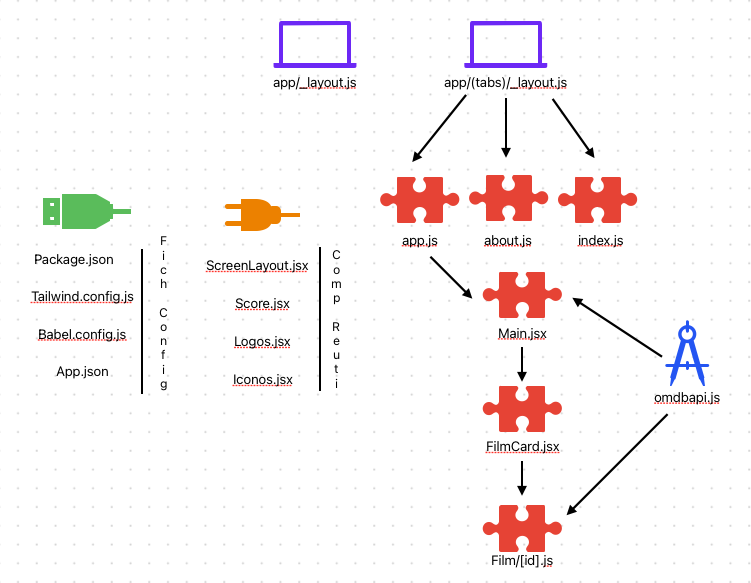

# React Native

Es más bien una plataforma de desarrollo completa porque no solo tiene componentes y una biblioteca.
La idea es aprender una vez y poder crear una aplicación en cualquier dispositivo móvil u ordenador incluso en la web.
Todo lo que tiene que ver en la interfaz de usuario se base en React, ya que además React Native utiliza la misma biblioteca.
La diferencia con la Web es que cuando lo queremos ejecutar en la web hay una dependencia llamada ReactDOM que es la que permite renderizar la aplicación en el ordenador. Tiene un sistema que hace una especie de puente para que pueda estar en los diferentes sistemas operativos móviles.

## Diferencia con otras plataformas

No es lo mismo a `CORDOVA` o `IONIC`, es distinto React Native está un poco más cerca de la plataforma porque si tiene un poco de código nativo por detrás.
CORDOVA o IONIC es una página web que se empaqueta directamente como un si fuese una aplicación y React Native no es una página web ya que tiene código nativo de cada aplicación.
También esta React Native para Windows y MacOs para app de escritorios por parte de Microsoft también tenemos la posibilidad a parte de las apps móviles (IOS y Android).

## Expo

Es un framework (seria el Next.js de React pero para React Native).
Enlace: `https://expo.dev/` para crear nuevos proyectos, documentación, características.

## Iniciar Proyecto

- `npx create-expo-app@latest nombre_proyecto` crear un proyecto de React Native con Expo.
- `npx create-expo-app curso-react-metacritic-app --template blank` crear un proyecto de React Native con Expo y al añadir el `-- template blank` quiere decir que queremos una plantilla vacía para que no venga todas las dependencias y cosas sino solo con lo mínimo para que funcione al ejecutarse.
  Las dependencias que instalas: `expo`, `expo-status-bar`, `react`, `react-native`, `@babel/core`.
- `npm install` para ejecutar todo, hay problemas con el `pnpm`.
- `npm start` te da la opción de abrir cualquier tipo de simulación y con otros comandos realizar otras acciones como refrescar.
- `npm run web` ejecutar la app en la web.
- `npm run ios` ejecutar la app en la iOS.
- `npm run android` ejecutar la app en la Android.

* Archivos que se crean en el proyecto:
  Tenemos el fichero `tsconfig.json`: de primeras viene configurado con Typescript, pero nosotros vamos a hacerlo con JavaScript.

El `package.json` donde hay un montón de dependencias que ha instalado por defecto al usar Expo, pero no vamos a utilizar ni la mitad. Nosotros mejor la vamos a instalar según las vayamos necesitando las dependencias.
Tenemos las carpetas de `hooks`, `constants`, `components`, `assets`, `tabs` (lo más importante), `app`...

El punto de entrada de la aplicación es el `main: expo-router/entry`, que es el enrutado.

Tenemos un `código QR` donde puede acceder cualquiera a la app a través de ella instalando la app `Expo Go` y estando en la misma red, y los comandos para situarse en otro tipo de ejecución como `IOS` o `Android`, o refrescar la app, etc.

Lo realmente sorprendente es como en `tiempo real se va actualizando` todos los cambios de forma inmediata en todos lados y esto nos da una muy buena experiencia de desarrollo.

### Instalando - Primeros pasos

1. `npx create-expo-app curso-react-metacritic-app --template blank`: creamos el proyecto solo con las dependencias necesarias.

Lo primero que nos damos cuenta de que no nos permite la opción de `web`, esa opción esta desactivada al poner que queríamos un proyecto vacío.

2. `npx expo install react-dom react-native-web @expo/metro-runtime` para instalar y poder ejecutar y verlo en la `web` con estas `3 nuevas dependencias`.

3. `npx expo lint` te instala las dependencias que se necesita de `Linter` y además crea el archivo de configuración, para poder ver los errores se necesitan las extensiones de VSC: `eslint`, `prettier - code formatter`.

4. `npx expo install --save-dev prettier eslint-config-prettier eslint-plugin-prettier` instalar otras dependencias necesarias de `Prettier`.
   Esta configuración se realiza en el fichero `.eslintrc.js`.

5. `npx expo install expo-consa` constante de Expo, instalamos constantes que nos ayudan y nos dan las constantes con dichos valores necesarios como `Constand.statusBarHeight` para dejar el espacio de seguridad necesario.

6. `npx expo install react-native-area-context`, componente SafeAreaProvider (mejor que `5. Constante Expo`) Para ello hay que envolver toda la aplicación en un `Provider`, lo mejor es que el punto de entrada, lo utilicemos para eso tener los `Providers` y `configuraciones`. Tendremos disponible un `Hook` llamado `useSafeAreaInsets` con los valores del `SafeArea` necesario para mostrar contenido.

7. `npx expo install react-native-svg`, añadir svg en la aplicación. (pasar de SVG a apto para React Native en `https://react-svgr.com/playground/?native=true`, copiamos el resultado y creamos una nueva clase como un componente y al pegarla la información ya lo tendríamos).

8. `npm install nativewind@2` (ya hay nueva versión 4) y `npm install --save-dev --save-exact tailwindcss@3.3.2`, vamos a decir que instale la versión exacta porque si no nos sale el karen y nos instala una versión superior. Inicializar el proyecto con `Tailwind` con `npx tailwindcss init`.
   Se crea el archivo `tailwind.config.js` y se edita el `babel.config.js`.
   Usamos `TailwindCSS` para mejorar los estilos sin afectar el rendimiento. No podemos utilizar directamente React Native porque los estilos como vimos no van por CSS se tiene que poner en unas clases Style.

9. `npx expo install expo-router react-native-safe-area-context react-native-screens expo-linking expo-constants expo-status-bar`, enrotudado con navegación entre pantallas. Con `expo-linking` se puede hacer una navegación profunda y navegar a otras aplicaciones externas como Google Maps, etc.
   Hay que modificar el `package.json` cambiando el punto de entrada por el enrutador.
   Hay que modfica el `app.json` añadiendo un `scheme`, solo en caso que queramos navegar a una aplicación externa.

10. `npm install @expo/vector-icons`, añadir iconos. Luego a través de `https://icons.expo.fyi/Index` se pueden seleccionar.
    Cuando usemos muchos iconos lo recomendable es crear un archivo `Icons.jsx` donde importemos todos los iconos que queramos (recomendable solo usar un tipo de iconos).

### Componentes del proyecto.

- `View`: la vista es como un <div> para cualquier bloque que queramos poner con la diferencia de que los elementos View son `display flex` por defecto.
- `Text`: las cadenas de texto siempre tienen que estar renderizadas entre la `etiqueta texto` (y sus estilos deben de estar en ella).
- `Styles`: se crea la hoja de estilos y dentro se tienen los estilos que vayamos poniendo.
- `Image`: para imágenes locales tenemos que importar en el código la imagen y luego para utilizar los valores se ponen en un factor de número de pixeles efectivos en pantalla (cuidado, efectivos en pantalla no son igual a reales).
- `Modo Oscuro o Claro`: desde un componente de Expo `StatusBar`
- `Button`: el estilo cambia según la plataforma de iOS o Android está el nativo.
  - El `button` es el tipo de botón nativo al cual no le puedes cambiar los estilos que vienen por otros, solo puedes el color del texto del botón.
  - Si quieres tener un botón con diferentes textos e imágenes es decir con el estilo que queramos, necesitamos otro componente: `TouchableHighlight`.
  - Existe un componente a un más avanzado llamado: `Pressable` para hacer algo pulsable donde se pueden hacer más cosas. `Pressable` es el más recomendable.
- `ScrollView`: para crear una vista, pero no es el recomendado debido a que no es de buen rendimiento, es buena idea para cajas de texto muy grandes que son estáticas o que hay varios elementos estáticos. Esta renderizando todos los elementos a la vez.
- `FlatList`: permite hacer scroll de manera más eficiente debido a que según haces scroll se renderiza dicho elemento que se visualiza.
- `ActivityIndicator`: indicador de carga.
- `SafeAreaView`: area de seguridad, problema es que solo funciona en iOS.
  - `Constante de Expo`, solución tambien para iOS y Android. (se necesita instalar dependecia).
  - `SafeAreaProvider`, es con una dependencia. Mejor opción de todas.
- `Animated`: componente para animar elementos, queremos que se animen uno delante del otro de forma secuencial y no que se animen todos de golpe (que también se podría hacer).

Hay muchas `Props` (propiedades) para cada etiqueta como la de `image` pero hay que tener en cuenta que hay muchas que son especificas solo para un dispositivo (`Android o IOS`). Circulo en `negro` solo `iOS`, circulo `verde` solo para `Android`.

No todas las `imágenes` van a tener porque usarse en `local` y si no se pueden coger desde la `web`, es decir remota y es diferente, en estos casos siempre se tiene que poner un `style` con el `width` y el `height`.

### Api - Servidor - Backend

Datos obtenidos de API de `OMDb API` [https://www.omdbapi.com/]. Es una API donde la gente puede obtener peliculas.

- Listado de peliculas: `https://omdbapi.com/?apikey=e6a1348e&s=sim`
- Pelicula en detalle: `https://www.omdbapi.com/?i=tt16255458&apikey=e6a1348e&y=2000`

### Esquema del proyecto.



- `Package.json`
- `Tailwind.config.js`
- `Babel.config.js`
- `App.json`

- `app/\_layout.js`: Layout general de toda la app. Se aplica a todas las rutas.
- `app/(tabs)/\_layout.js`: Layout de las tabs. Crea navegación tipo pestañas (tab bar).
  - `app.js`: Layout de las tabs. Crea navegación tipo pestañas (tab bar).
  - `about.js`: Ruta accesible en pestaña about.
  - `index.js`: Este archivo es el default que se carga si no se especifica una ruta. Por eso si lo borras, da error.
    - `omdbapi.js`
    - `Main.jsx`
    - `FilmCard.jsx`
    - `Film/[id].js`: Ruta dinámica para acceder a detalles de una película.
      - `ScreenLayout.jsx`
      - `Score.jsx`
      - `Logos.jsx`
      - `Iconos.jsx`

### Dudas.

#### 1. ¿Cuando usar ficheros `js` o `jsx`?

#### 2. ¿Cual es el `punto de entrada` de mi aplicación? (si borro el `index.js`, me da error)

Estás usando Expo Router, lo cual cambia por completo cómo funciona el punto de entrada de tu aplicación. No usas directamente index.js como en un proyecto clásico de React. Te explico cómo se organiza todo:

```json
"main": "expo-router/entry" // Esto le dice a Expo que use Expo Router, que convierte la estructura de carpetas en rutas automáticas.
```

- ¿Por qué no parece que se esté usando `index.js`?
  Porque no lo llamas tú manualmente: lo carga automáticamente `expo-router` cuando:
  • Estás en la `raíz de la pestaña (tabs)/` y `no hay otra ruta específica`.
  • Estás usando una `tab` que no define `initialRouteName`.

- Y cómo se conecta todo?

1. `expo-router/entry` carga el layout global `app/_layout.js`.
2. Dentro de `_layout.js`, usas <Slot /> o <Stack /> para representar las subrutas.
3. Si estás en `/`, entra al layout `app/(tabs)/\_layout.js` y renderiza tus tabs (`app.js, about.js, etc.`).
4. `index.js` es el fallback (pantalla por defecto) si no se indica `una ruta específica`.

- ¿Dónde está expo-router/entry.js?
  No lo vas a ver en tu proyecto. Es un módulo interno de expo-router, así que no necesitas crearlo ni tocarlo. Ese archivo “invisible” configura y carga tu estructura de carpetas como rutas. Solo se referencia en tu `package.json:`

```json
"main": "expo-router/entry"
```

- No uso <Slot/> sino <Stack /> — ¿está bien?

Sí, está bien. Depende del tipo de navegación que estés creando:

- <Slot />: Renderiza las subrutas automáticamente (layout general)
- <Stack />: Para navegación tipo pila (como navegación a detalles)
- <Tabs />: Para navegación con pestañas (como en tu caso)

- ¿Cómo se define la pantalla por defecto en Tabs?
  Es probable que te preguntes esto porque `index.js` se está usando sin que tú lo declares explícitamente. Eso es porque `expo-router` trata `index.js` como la ruta por defecto automáticamente si no lo cambias.

Si quieres especificarlo tú mismo:

```tsx
<Tabs
  initialRouteName="app" // <- Aquí defines qué ruta/tab es la "default"
>
  <Tabs.Screen name="app" options={{ title: "Inicio" }} />
  <Tabs.Screen name="about" options={{ title: "Sobre el proyecto" }} />
</Tabs>
```

- ¿Y si quiero eliminar `index.js`?
  Puedes hacerlo siempre que definas initialRouteName en el Tabs, como te acabo de enseñar arriba.
  Si no pones `initialRouteName`, expo-router usará `index.js` automáticamente. Por eso, si lo borras sin definir esa opción, da error.

#### 3. `Mejorar` la aplicación...

// Trancribir respuesta de la duda 1 de js y jsx.
// Freeform crear el esquema bonito.
// Ir a la duda 3. y realizarlo todo practico.

// Hablar con Alberto y comentarle lo del icono y subir TFM al moddle.
// Llamar al médico para que me atienda y me vea los analisis.
// Sacar sudadera negra.
